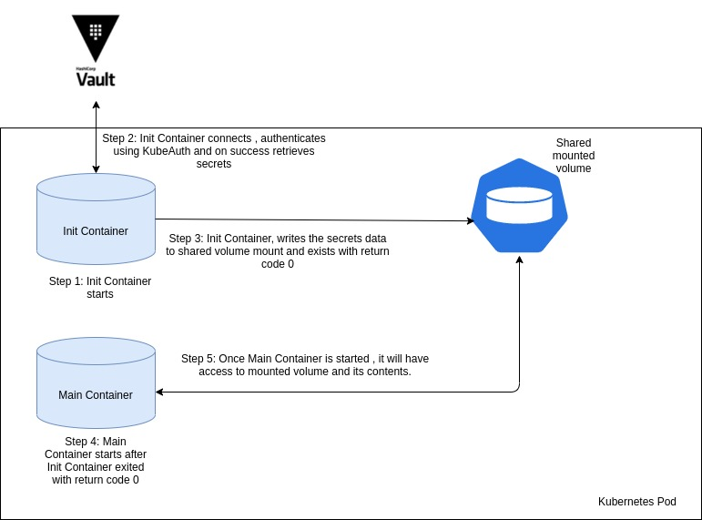
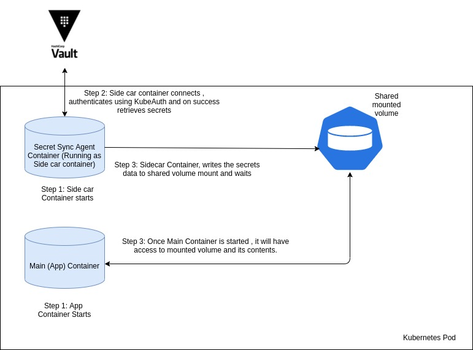

# secrets-sync-agent

The secrets-sync-agent can be used to <br>
* Create and update/refresh (periodically) secrets in OpenShift/K8 platform with Hashicorp vault secrets<br>
* As an init or a sidecar container to provide secrets to an application container<br>


## Motivation 

There are usecases where we would need secrets from (Hashi) vault but those secrets needs to be available in OpenShift Container Platform and to enhance the user (on boarding to OpenShift Platform) experience <br>

### Platform Secrets <br>

* ImagePullSecrets <br>
     *  The secrets that are required to connect to artifactory to pull images <br>
* TLS Secrets <br>
    *  The TLS certificates that are required to configure cluster <br>
* SSH-Auth Secrets <br> 
    *  The secrets that are required to SSH Auth such as during image build etc <br>
* Operator secrets <br>
     *   Some vendor provided operators require Openshift/K8 secrets to function and do not provide an alternative mechansim for injecting 
            confidential data <br>
            
### Application secrets <br>

*   Some legacy applications that can not be modified to use/connect to Hashi vault <br>
*   Based on architecture if the applictaions needs to be Hashi vault agnostic
*   A dedicated container to provide application secrets rather than application handling the logic
        

## What type of Platform secrets this agent supports ?

For now, supported secret types are <br>
* ImagePullSecrets
* TLS
* Opaque
* Opaque based on template (Jinja2)
* Ssh-Auth


## Platform Secrets 

### How does it work?

For deploying the Secrets Sync Agent, as a pre requirement two configMaps are needed - which controls how it functions.

*  The first configMap contains connection details of vault instance and configuration used for kubeAuth

    An example 

    ```yaml
    ---
    kind: ConfigMap
    apiVersion: v1
    metadata:
      name: connection-info
    data:
      vault_connection_info.yaml: |
        ---
        VAULT_ADDR: http://52.116.136.244:8200/
        VAULT_LOGIN_ENDPOINT: v1/auth/kubernetes/login
        VAULT_ROLE: suman-test
    ```

*  The second configMap contains details of which secrets to retrieve from vault, name of the secret to create and type of secrets to create<br>

    An example

    ```yaml
    ---
    kind: ConfigMap
    apiVersion: v1
    metadata:
      name: secrets-info
    data:
      vault_secrets_info.yaml: |
        ---
        KUBE_SECRETS:
           - VAULT_SECRET_PATH: v1/secret/data/appsecrets
             KUBERNETES_SECRET: demo-appsecrets
             SECRET_TYPE: opaque

           - VAULT_SECRET_PATH: v1/secret/data/appsecrets
             KUBERNETES_SECRET: demo-appsecrets-template
             SECRET_TYPE: opaque
             TEMPLATE_AS_CONFIGMAP: template-testing

           - VAULT_SECRET_PATH: v1/secret/data/nonprod-registry
             KUBERNETES_SECRET: suman-test-template
             SECRET_TYPE: dockercfg

           - VAULT_SECRET_PATH: v1/secret/data/certs
             KUBERNETES_SECRET: demo-appcerts
             SECRET_TYPE: tls

           - VAULT_SECRET_PATH: v1/secret/data/auth
             KUBERNETES_SECRET: demo-ssh-auth
             SECRET_TYPE: ssh-auth
    ```    
 
<br><br>**We can provide connection and secret retrieval information in multiple ways


| Name              | Default Value | Description |
| :--- | :---  | :---  |
| DEFAULT_CONNECTION_INFO_FILE | /etc/secrets_sync_agent/connection_info/vault_connection_info.yaml | Users need to mount the connection information configuration file in this location and program will automatically pick this file|
| DEFAULT_SECRETS_RETRIEVAL_INFO_FILE | /etc/secrets_sync_agent/secrets_info/vault_secrets_info.yaml | Users need to mount the secrets retrieval information configuration file in this location and program will automatically pick this file|
| VAULT_CONNECTION_INFO_CONFIG_FILE | - | User can mount connection information configuration file to any location and provide absolute file location|
| VAULT_SECRETS_RETRIEVAL_INFO_CONFIG_FILE | - | User can mount secrets retrieval information configuration file to any location and provide absolute file location
| VAULT_CONNECTION_INFO_CONFIGMAP_NAME | - | Name of a configmap with connection information. This requires API access to read configmap |
| VAULT_SECRETS_RETRIEVAL_INFO_CONFIGMAP_NAME | - | Name of a configmap with secrets retrieval information.. This requires API access to read configmap|


##### Variable Definition Precendence

The above mechanisms for providing configuration values can be used together in any combination. If the same configuration is assigned multiple values, agent uses the configuration with highest precedence

Agent loads configuration in the following order, with later sources taking precedence over earlier ones<br>
* Default configuration (DEFAULT_CONNECTION_INFO_FILE and DEFAULT_SECRETS_RETRIEVAL_INFO_FILE)
* User explictly provided configuration (VAULT_CONNECTION_INFO_CONFIG_FILE and VAULT_SECRETS_RETRIEVAL_INFO_CONFIG_FILE)
* ConfigMap (VAULT_CONNECTION_INFO_CONFIGMAP_NAME and VAULT_SECRETS_RETRIEVAL_INFO_CONFIGMAP_NAME) 


##### OpenShift/K8 secrets with in a Namespace

This agent can be used to create/refresh(periodically) OpenShift/K8 platform secrets in the same namespace. Aformentioned two configMaps are to create/refresh secrets in a namespace where this agent is running.


##### OpenShift/K8 secrets with in a different Namespace

This agent can also be used to create secrets in a different namespace as well, provided serviceaccount used with appropriate rbac policy.


**Recommeded to use a namespace scoped , unless for specific reasons or for automations


```yaml
---
kind: ConfigMap
apiVersion: v1
metadata:
  name: secrets-info
data:
  vault_secrets_info.yaml: |
    ---
    KUBE_SECRETS:
      - VAULT_SECRET_PATH: v1/secret/data/nonprod-registry
        KUBERNETES_SECRET: demo-nonprod-registry
        SECRET_TYPE: dockercfg
        NAMESPACE: splunk-connect


      - VAULT_SECRET_PATH: v1/secret/data/splunk-hec-token
        KUBERNETES_SECRET: splunk-hec-token
        SECRET_TYPE: opaque
        NAMESPACE: splunk-connect
```

## Secrets in Application Pod 

This agent can also be used as an init or sidecar container to provide secrets to an application container through shared volumeMount. Similar to creating secrets in OpenShift/K8 platform, this agent needs two configMaps, however the second ConfigMap would be different. Based on the information provided in configMap's, agents connects to Hashi vault, retrieve secrets and creates file(s) with secrets data in a shared volumeMount for application (main) container to consume.

**Recommneded to used emptyDir with medium memory to avoid writing secrets to host disk

```yaml
volumes:
  - name: application-secrets
    emptyDir:
      medium: Memory
```

Agent can provide scerets in various file formats such as -
*  Json 
*  Yaml
*  Ini
*  env(KV pairs)
*  a single value to file based on selected key
*  Jinja2 template

An example configMap to retrieve secrets data

```yaml
kind: ConfigMap
apiVersion: v1
metadata:
  name: secrets-data
data:
  vault_secrets_info.yaml: |
    ---
    FILE_SECRETS:
       -   VAULT_SECRET_PATH: v1/secret/data/appsecrets
           TO_FILE_NAME: /root/suman/working/test_dir/appsecrets.ini
           FILE_FORMAT: ini
           INI_SECTION_NAME: app-secrets

       -   VAULT_SECRET_PATH: v1/secret/data/appsecrets
           TO_FILE_NAME: /root/suman/working/test_dir/appsecrets.json
           FILE_FORMAT: json

       -   VAULT_SECRET_PATH: v1/secret/data/appsecrets
           TO_FILE_NAME: /root/suman/working/test_dir/appsecrets.yml
           FILE_FORMAT: yaml

       -   VAULT_SECRET_PATH: v1/secret/data/appsecrets
           TO_FILE_NAME: /root/suman/working/test_dir/appsecrets.env
           FILE_FORMAT: env

       -   VAULT_SECRET_PATH: v1/secret/data/appsecrets
           TO_FILE_NAME: /root/suman/working/test_dir/appsecrets.txt
           FILE_FORMAT: key
           KEY: key1

       -   VAULT_SECRET_PATH: v1/secret/data/appsecrets
           TO_FILE_NAME: /root/suman/working/test_dir/properties.ini
           TEMPLATE_AS_CONFIGMAP: properties-template
```

##### Jinja2 templating ConfigMap
```yaml
kind: ConfigMap
apiVersion: v1
metadata:
  name: properties-testing
data:
  template-testing-cm.config: |
    spring.datasource.url=jdbc:mysql://{{ values['mysql_host'] }}:3306/{{ values['mysql_db'] }}
    spring.datasource.username={{ values['mysql_user'] }}
    spring.datasource.password={{ values['mysql_password'] }}
```


##### Init Container Mode
To use this agent as an init container, we simply need to update application Deployment or DeploymentConfig YAML adding "secret-sync-agent" as an init container to application pod. 





##### SideCar Container Mode
This is similar to an init container mode mentioned abve, but the container continues to run alongside the application container after startup, in what is known as a sidecar container pattern. It will continue to peridically read the secrets from hashi Vault and if they have been changed, it will update thh files it wrote with the new secret value. Application containers should be able to read the secrets from files on shared volume whilst runninng without restarting. Also, as both side car container and main (application) container start at the same time, secrets might not be available ffor main (application) container, so application should be able to handle this. 




In addition to aforementioned, application developes can also use both init or sidecar containers in the same Deployment or DeploymentConfig. 

In this approach:
*  An init container would start first retrieve the secrets from Hashi Vault and write the secret's contents to a shared volumeMount
*  As soon as an init container exists with the return code 0 (graceful exit) 
    *   Sidecar (secrets-sync-agent) container will start
    *   Application (main) container will also start
*  As soon as the main container starts, it can read secrets from the shared volumeMount written by an init container
*  Any changes to secrets  in Vaultm will be refreshed by sidecar (secrets-sync-agent) container
*  Application  can read the updated or refreshed secrets from the shared volumeMount whithout restrating 
